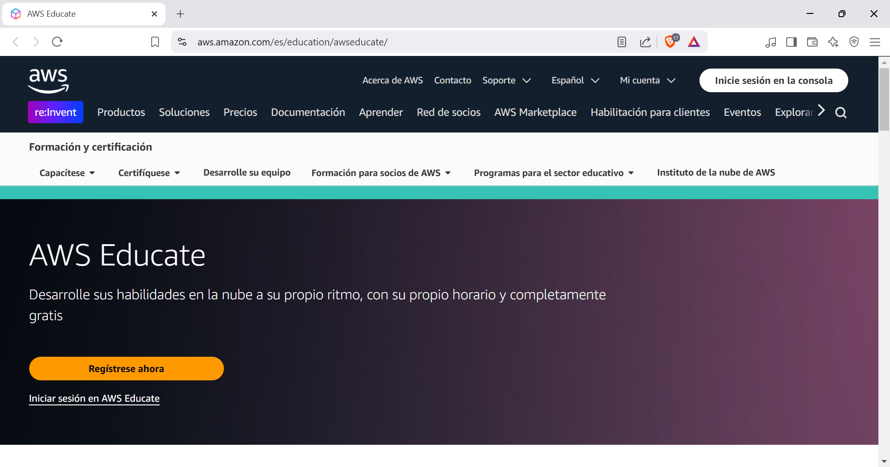
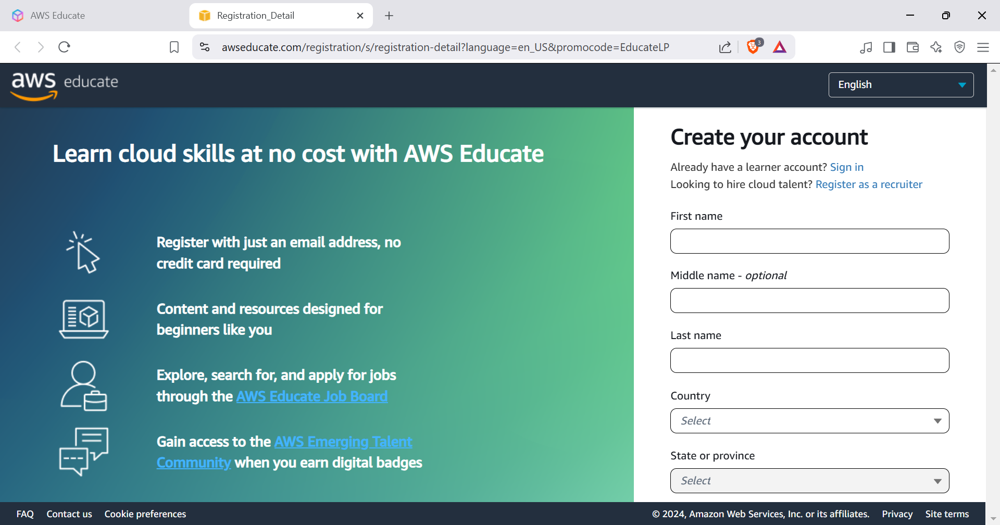
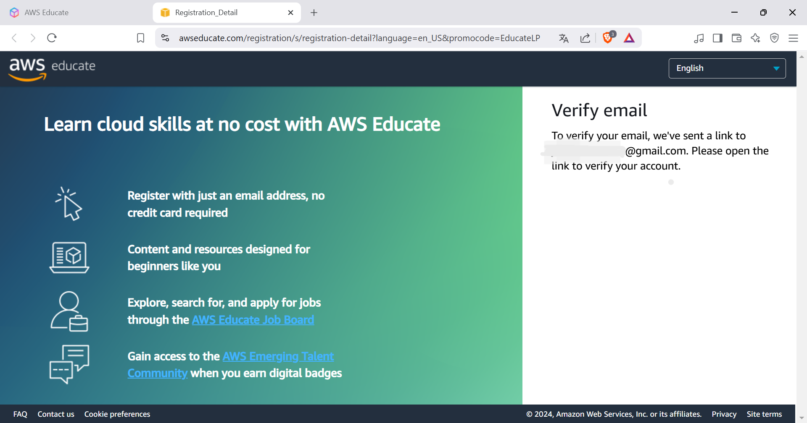
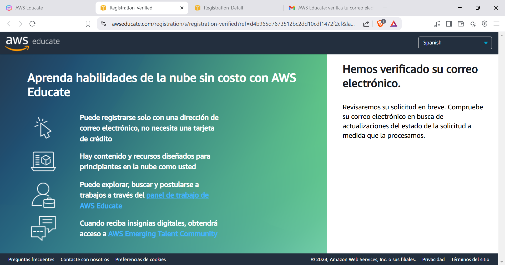
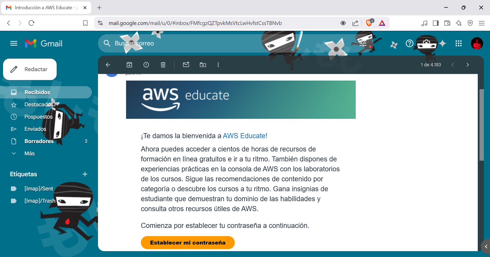
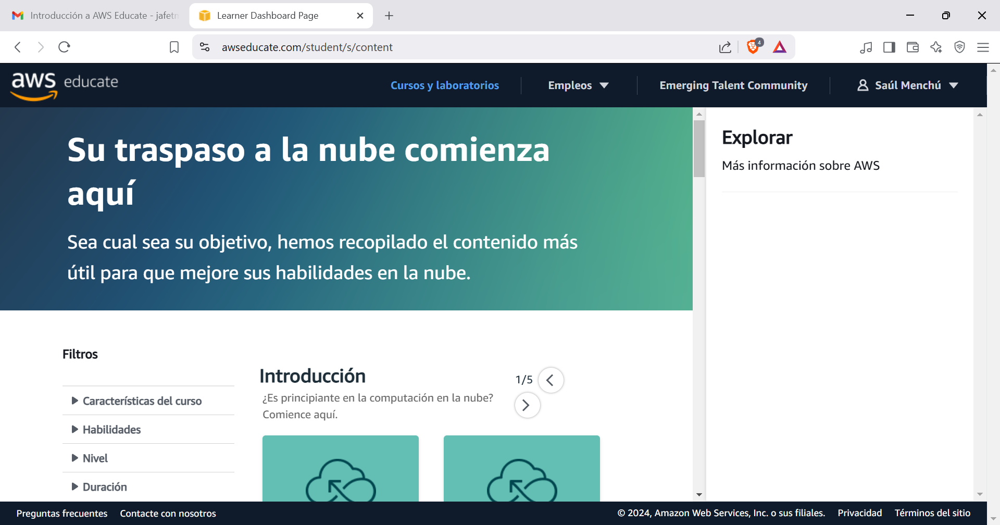
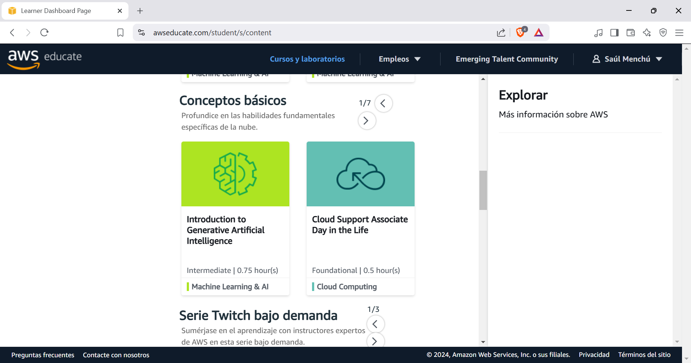
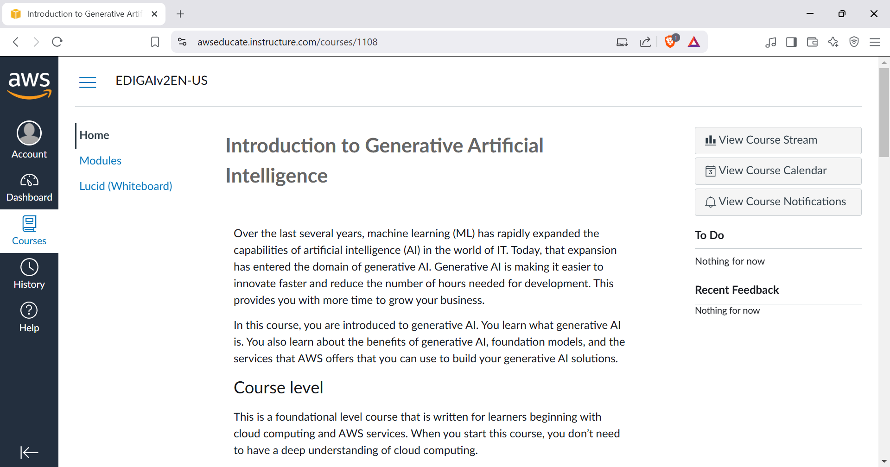
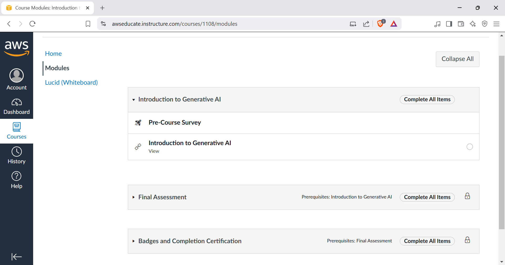

# Conferencia AWS: EC2 y S3
### 28 de marzo de 2025
____

## **Cómo obtener descuento del 100% para los certificados de AWS**
A continuación se detallan los pasos para la obtención del descuento del 100% para los certificados de AWS.
>Fuentes: 
[Twitter - midudev](https://x.com/midudev/status/1897644988780953700) 
[LinkedIn](https://x.com/midudev/status/1897644988780953700) 

___

  

  

  

  

  

  

  

  

  

