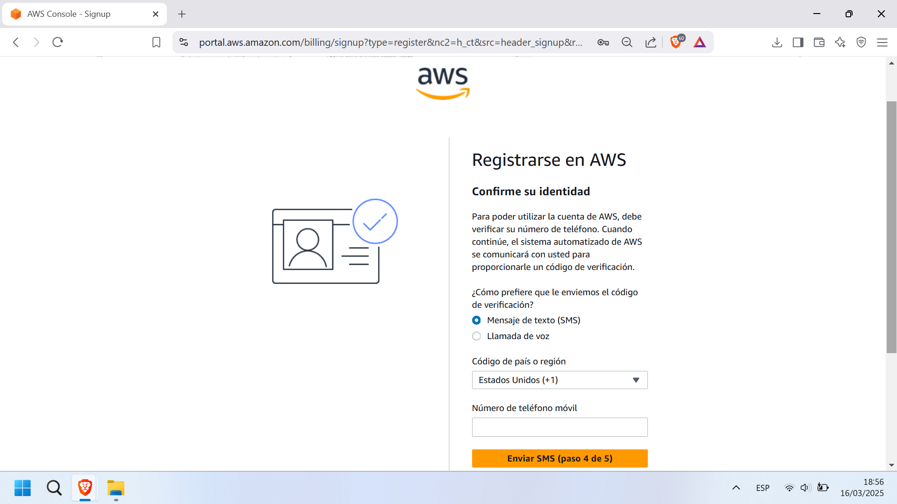
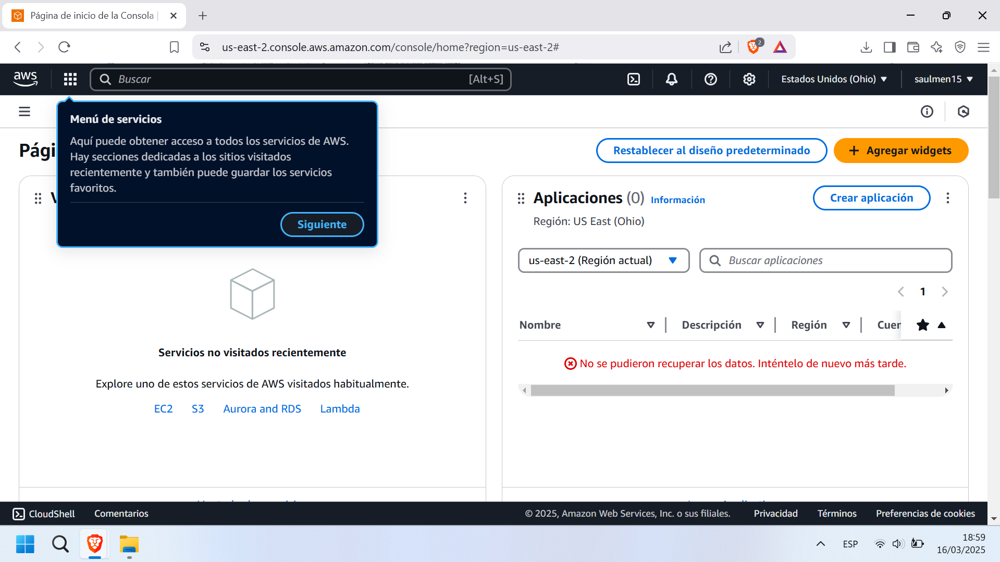

# Conferencia AWS: EC2 y S3
### 28 de marzo de 2025
____
## **Capa Gratuita**
A continuación se detallan los pasos para la creación de la cuenta en AWS para obtener la capa gratuita.
____
Ingresar a la página de AWS en el siguiente [enlace](https://aws.amazon.com/es/resources/create-account/). Click en el botón "Crear una cuenta de AWS"

  

Llenar los campos para correo electrónico y nombre de la cuenta.

  

Se enviará un código de verificación al correo ingresado anteriormente

  

Ejemplo del correo de verificación:

  

Ingreso del código:

  

Se le notificara que el correo fue verificado exitosamente

  

Completar los campos para la contraseña de la cuenta

  

Completar los campos para la información de contacto:

  

  

Completar los campos con la información de facturación de la cuenta:

  

  

Mensaje de información del cobro para la capa gratuita:

  

Llenar los campos para el envió de connfirmación de indentidad:

  

Verificación de seguridad:

  

Ingresar el código de verificación de identidad:

  

____

Selección de la capa gratuita:

  

  

  

Al completar estos pasos, ya tendrás acceso a los servicios de AWS de la capa gratuita durante 1 año a partir de la fecha de creación de la cuenta.