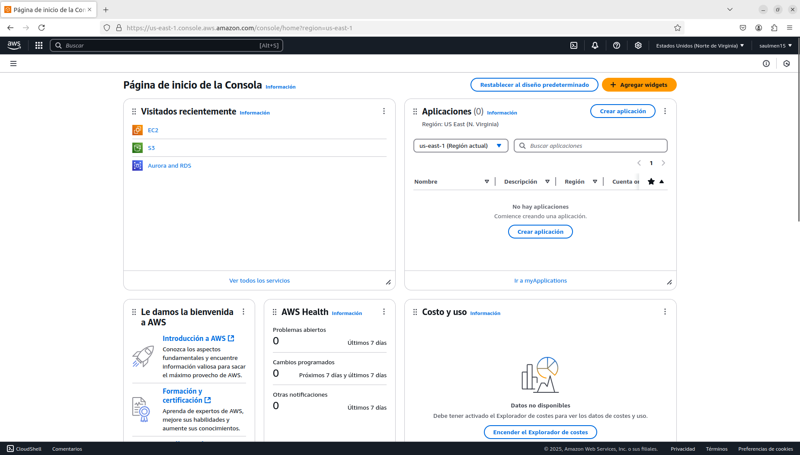
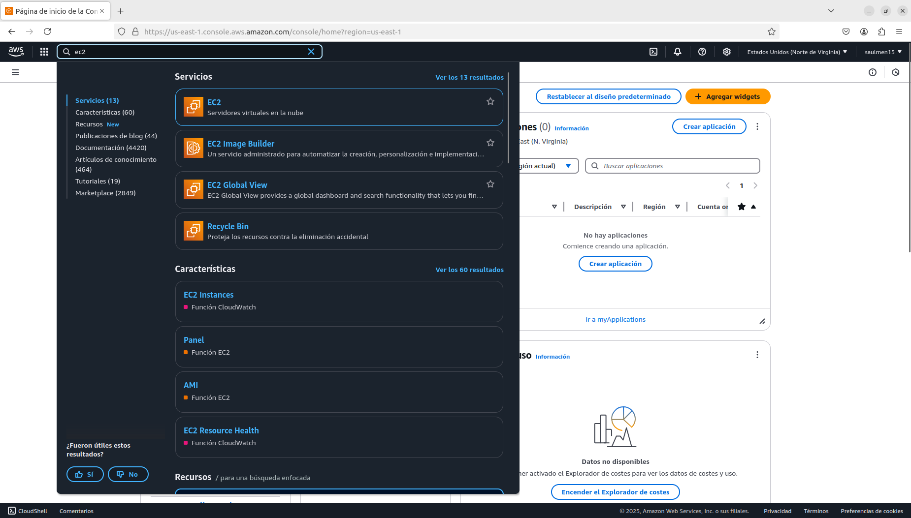
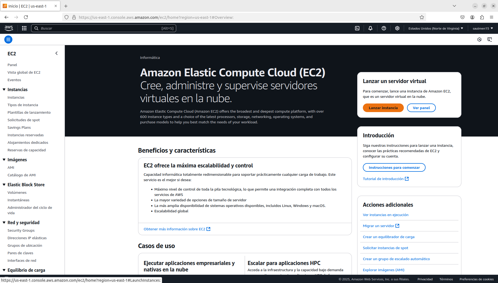
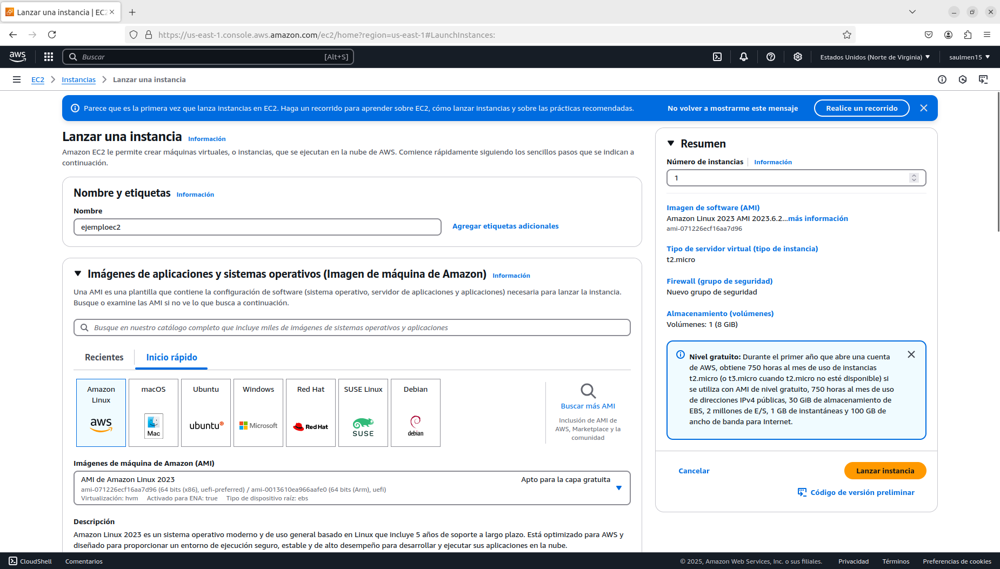
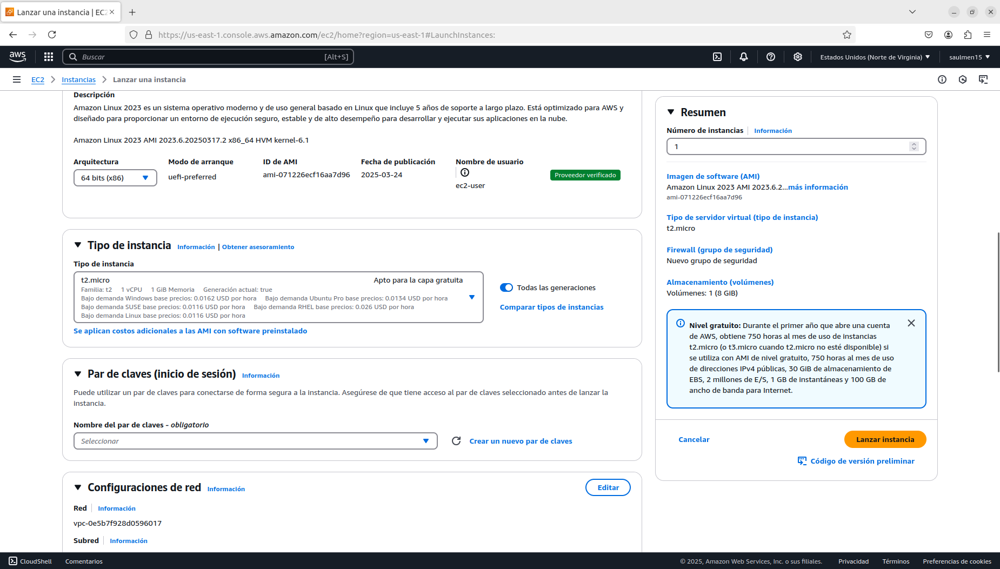
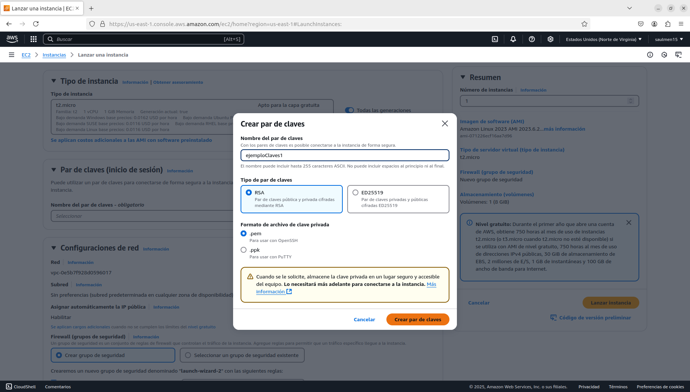
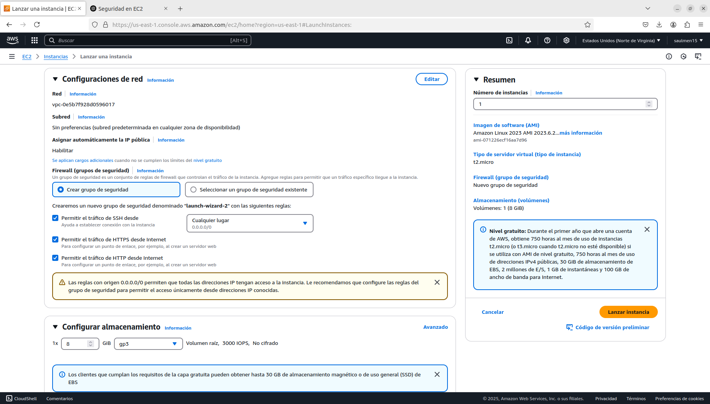
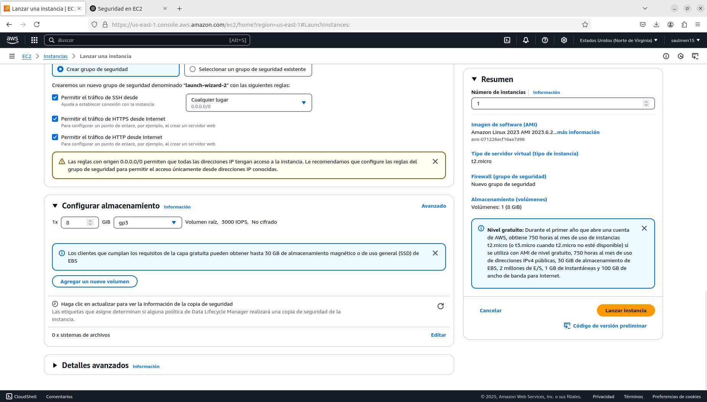
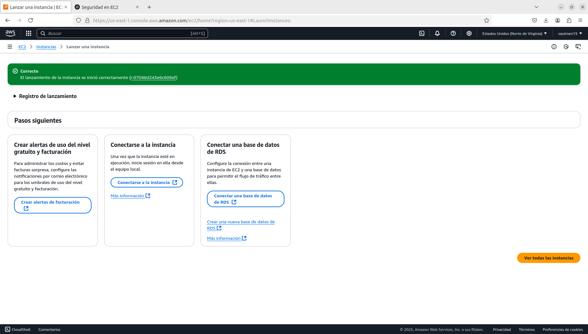
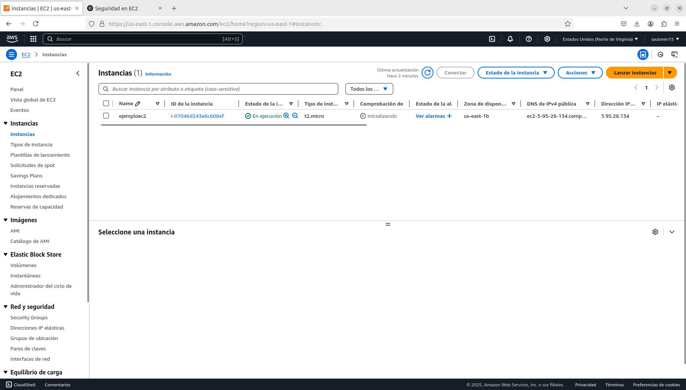

# Conferencia AWS: EC2 y S3
### 28 de marzo de 2025
____
## **Creación EC2**
A continuación se detallan los pasos para la creación de una instancia EC2.
____

Inicio de la consola de AWS
<p align="center">
  
</p>

Buscamos "EC2", damos click
<p align="center">
  
</p>

Seleccionamos la opción lanzar instancia
<p align="center">
  
</p>

Llenamos el campo para le nombre de la instancia y debemos seleccionar ubuntu.
<p align="center">
  
</p>

Para el tipo de instancia dejamos la predeterminda (t2.micro) que sea opta para la capa gratuita.
<p align="center">
  
</p>

Creamos un nuevo par de claves, llenamos el campo de nombre y seleccionamos la opción `RSA` y la opción con extension `.pem`
<p align="center">
  
</p>

En configuración de red seleccionamos todas, `SSh`, `HTTPS`, `HTTP`
<p align="center">
  
</p>

Las demás configuraciones las dejamos tal y como están y le damos a `Lanzar instancias`
<p align="center">
  
</p>

<p align="center">
  
</p>

Luego en el panel de EC2 podemos observar nuestra instancia
<p align="center">
  
</p>

____
## **¿Cómo me conecto a mi instancia EC2 desde mi computadora?**

Para este caso usaremos `Termius`, `Termius` es un cliente SSH gratuito y seguro, permite administrar fácilmente todos nuestros servidores. Proporcionar conexiones seguras y cifradas, garantizando la seguridad de los datos confidenciales durante el acceso remoto a servidores.

____
## **¿Qué hacer una vez estemos dentro de nuestra instancia?**
Ejecutamos
```bash
sudo apt update && sudo apt upgrade -y
```
Esto para actualizar los paquetes para asegurarnos de tener la última versión del software y las correcciones de seguridad.

### **Go**
Obtenemos la última versión de `Go`
```bash
wget https://go.dev/dl/go1.24.1.linux-amd64.tar.gz
```

Eliminamos y extraemos
```bash
 rm -rf /usr/local/go # elimnar versiones antiguas
 
 sudo tar -C /usr/local -xzf go1.24.1.linux-amd64.tar.gz # extraermos la versión descargada
```

Configuramos las variables de entorno
```bash
echo 'export PATH=$PATH:/usr/local/go/bin' >> ~/.bashrc
echo 'export GOPATH=$HOME/go' >> ~/.bashrc
echo 'export PATH=$PATH:$GOPATH/bin' >> ~/.bashrc
```

```bash
source ~/.bashrc
```

Verificar instalación
```bash
go version
```

permisos
```bash
sudo chmod -R 777 /home
```

Instalar Graphviz
```bash
sudo apt-get update
sudo apt-get install graphviz

dot -V
```

Para subir imagenes al S3
```bash
go get github.com/aws/aws-sdk-go

go get github.com/aws/aws-sdk-go-v2/aws
go get github.com/aws/aws-sdk-go-v2/config
go get github.com/aws/aws-sdk-go-v2/service/s3
```

### **React**
```bash
# Download and install nvm:
curl -o- https://raw.githubusercontent.com/nvm-sh/nvm/v0.40.2/install.sh | bash

# in lieu of restarting the shell
\. "$HOME/.nvm/nvm.sh"

# Download and install Node.js:
nvm install 22

# Verify the Node.js version:
node -v # Should print "v22.14.0".
nvm current # Should print "v22.14.0".

# Verifica versión de npm:
npm -v # Debería mostrar "10.9.2".
```

Creamos la app en react
```bash
npx create-react-app my-app
cd my-app
```

Iniciamos
```bash
npm start
```

```json
"scripts": {
  "start": "HOST=0.0.0.0 PORT=3000 react-scripts start"
}
```

```bash
npm install react-router-dom
npm install axios

```


____
## **Creación Bucket en S3**

